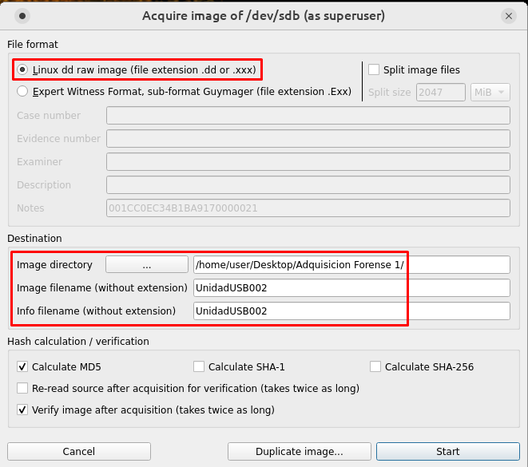
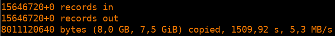
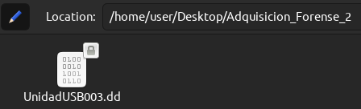

# Adquisición Forense de una memoria USB

Para la realización de esta actividad elegiremos una memoria USB de 8GB de espacio, de marca Kingston Data Traveler.

## AccessData FTK Imager

Comenzamos usando la aplicación FTK Imager en una máquina virtual con Windows 10. Para realizar el clonado de la susodicha memoria USB elegimos la pestaña ***Create Disk Image*** para crear una imagen del pen-drive, elegimos la opción ***Physical Drive*** o "Disco físico" y finalmente elegimos el pen-drive cuando se nos dé la opción.

El formato que elegiremos para el clonado será el formato en bruto o ***Raw***, y después de esto rellenaremos la información que se nos pide.

Antes de comenzar con el clonado del pen-drive deberemos elegir donde depositar el clonado de la memoria USB, además de darle un nombre.

Luego podremos ver cómo se clona la memoria USB elegida.

Terminado todo el proceso veremos en el escritorio (lo he elegido paara la demostración) la imagen creada de la memoria USB junto con un extracto en formato txt que contiene los detalles más importantes del clonado y de la memoria USB. Además, también podemos verificar el hash de la memoria clonada, comparándolo con el de la memoria USB que hemos clonado.

 

## GuyImager

Para usar esta herramienta, hemos elegido el SO CAINE, usado para el ámbito de la forensia digital. Lo primero que haremos será elegir nuestro dispositivo USB y elegir la opción ***Acquire Image***, y luego optaremos por una imagen de formato .dd. Finalmente sólo tendremos que elegir una ubicación y darle un nombre a la imagen que adquiriremos.

Cuando termine la operación, podremos acceder a la información generada tanto en la carpeta donde se ha creado la imagen o haciendo clic en la opción ***Info***

Como podemos ver, ya tenemos nuestra imagen forense en formato .dd de la memoria USB original

 

## Comando dd

Finalmente haremos uso del comando ***dd*** de los sistemas Linux para realizar una copia bit a bit de un dispositivo de almacenamiento. Este comando crea una imgen del dispositivo o disco original. Para mayor comodidad, hemos vuelto a elegir el formato .dd. También indicamos la ubicación de la imagen a crear, el tamaño del bloque de lectura/escritura, que será de 512 bytes, y las opciones ***noerror***, que indica que se continúe copiando incluso si se encuentran errores de lectura en el dispositivo de origen (USB) y ***sync***, que rellena los bloques de salida con ceros si no se pueden leer suficientes datos desde el dispositivo a copiar.

Una vez que se termina la operación, podremos ver cierta información de la copia como el tamaño y la velocidad, así como el archivo .dd en la carpeta de destino.

